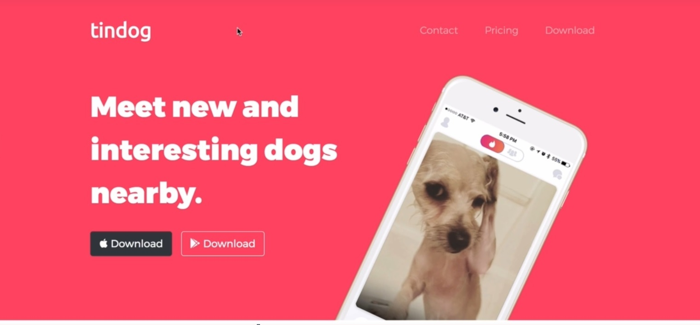
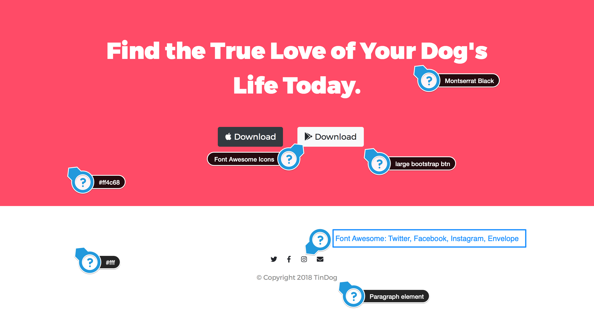

# The Complete 2021 Web Development Bootcamp - TinDog : A Bootstrap Course Challenge

## Welcome! 👋

Thanks for checking out this front-end coding challenge.

## Table of contents

- [The challenge](#the-challenge)
- [Solution's Links](#links)
- [My process](#my-process)
- [Built with](#built-with)
- [What I learned](#what-i-learned)
- [Continued development](#continued-development)
- [Author](#author)

### The challenge

- Build out the project to the designs provided
- Using Bootstrap 4 as a CSS Framework
- Responsive design for all screen sizes
- Hover states for all interactive elements on the page
- Desktop Design preview
  
  

### Solution's Links

- Solution URL: (https://github.com/youssicode/tinDog-bootstrap)
- Live Site URL: (https://youssicode.github.io/tinDog-bootstrap/)

## My process

- Linking the HTML file with Bootstrap libreries, styling files, images, web-fonts, Fontawsome's icons ..
- Styling the page (Desktop desing) starting from top to bottom
- Choosing the apropriate Bootstrap 4 classes to layout the page's elements.
- Styling some elements in Mobile's version using media queries.
- Refactoring our CSS code as possible.
- Uploading and hosting all files in github.com

### Built with

- Semantic HTML5 markup
- Bootstrap 4 Framework
- CSS 3 custom properties
- Fontawesome icons
- Google web fonts

### What I learned

- Dealing with Bootstrap Framework and Layout the web pages using its classes
- Responsive Web Design using both Bootstrap and Media Queries
- Caring about details on both designs (Desktop and mobile)
- Learning a lot of new tips in coding

### Continued development

- Mastering Bootstrap Framework and Responsive Mobile-First Design.

## Author

- LinkedIn - [@youssef-el-hrouzi](https://www.linkedin.com/in/youssef-el-hrouzi/)
- Frontend Mentor - [@youssicode](https://www.frontendmentor.io/profile/youssicode)
- Facebook - [@youssef.elhrouzi](https://www.facebook.com/youssef.elhrouzi)
